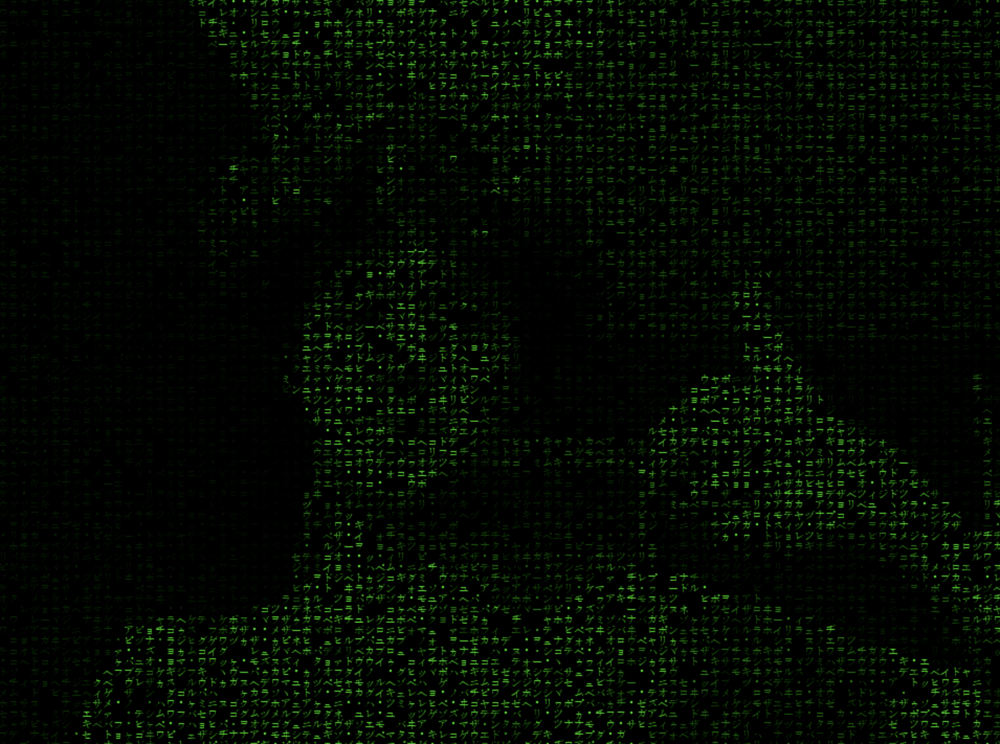

# MatrixVision

## Requirements

See full requirements in [requirements.txt](requirements.txt).

## Introduction

**MatrixVision** is a Python app that adds a matrix effect to your camera.
The app is inspired by code from **[CoderSpace](https://www.youtube.com/@CoderSpaceChannel)**'s YouTube channel.

## Contact

- [Discord](https://discord.com/users/873920068571000833)
- [GitHub](https://github.com/CrazyFlyKite)
- [Email](mailto:karpenkoartem2846@gmail.com)
